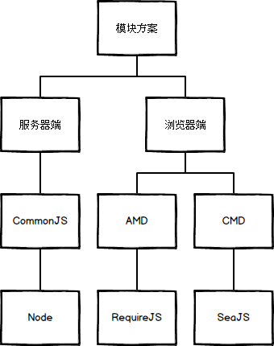
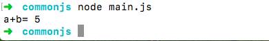

# 什么是模块化？
随着网站逐渐变成"互联网应用程序"，嵌入网页的Javascript代码越来越庞大，越来越复杂。如果一直像之前一样在script标签中嵌入几十上百行代码来实现一些基本的交互效果，如果一个网页有很多的js文件，那么浏览器在下载该页面的时候会先加载js文件，从而停止了网页的渲染，如果文件越多，浏览器可能失去响应。其次，要保证js文件的依赖性，依赖性最大的模块（文件）要放在最后加载，当依赖关系很复杂的时候，代码的编写和维护都会变得困难。

Javascript模块化编程，已经成为一个迫切的需求。理想情况下，开发者只需要实现核心的业务逻辑，其他都可以加载别人已经写好的模块。但是模块开发需要遵循一定的规范，否则就都乱套了。

# 如何实现模块化？

## CommonJS

CommonJS是服务器端模块的规范，Node.js采用了这个规范。Node.JS首先采用了js模块化的概念。

根据CommonJS规范，一个单独的文件就是一个模块。每一个模块都是一个单独的作用域，也就是说，在该模块内部定义的变量，无法被其他模块读取，除非定义为global对象的属性。

输出模块变量的最好方法是使用module.exports对象。

	var i = 1;
	var max = 30;
	
	module.exports = function () {
	  for (i -= 1; i++ < max; ) {
	    console.log(i);
	  }
	  max *= 1.1;
	};
	
上面代码通过module.exports对象，定义了一个函数，该函数就是模块外部与内部通信的桥梁，该模块内部定义的变量，无法被其他模块读取，除非定义为global对象的属性。

我们加载模块使用require方法，该方法读取一个文件并执行，最后返回文件内部的module.exports对象。

下面是一个完整的例子

math.js

	var add = (a, b) => {  
	  console.log("a+b=",a+b)  
	  return a+b  
	}  
	  
	module.exports = {  
	  add  
	}  
	
main.js

	var math = require('./math');  
	math.add(2, 3); 

打印结果：

## 思考？

main.js文件中第二行math.add(2, 3)，在第一行require('math')之后运行，因此必须等math.js加载完成。也就是说，如果加载时间很长，整个应用就会停在那里等。
这对服务器端不是一个问题，因为所有的模块都存放在本地硬盘，可以同步加载完成，等待时间就是硬盘的读取时间。但是，对于浏览器，这却是一个大问题，因为模块都放在服务器端，等待时间取决于网速的快慢，可能要等很长时间，浏览器处于"假死"状态。
因此，浏览器端的模块，不能采用"同步加载"（synchronous），只能采用"异步加载"（asynchronous）。这就是浏览器端模块化（AMD、CMD）规范诞生的背景。

## AMD

AMD是"Asynchronous Module Definition"的缩写，意思就是"异步模块定义"。它采用异步方式加载模块，模块的加载不影响它后面语句的运行。所有依赖这个模块的语句，都定义在一个回调函数中，等到加载完成之后，这个回调函数才会运行。目前，主要有两个Javascript库实现了AMD规范：require.js和curl.js。本文是以require.js作为例子。

AMD也采用require()语句加载模块，但是不同于CommonJS，它要求两个参数：
 
	require([module], callback);  

第一个参数[module]，是一个数组，里面的成员就是要加载的模块；第二个参数callback，则是加载成功之后的回调函数。如果将前面的代码改写成AMD形式，就像下面的代码：

main.js

	require.config({  
	    paths:{  
	      "math": "math"  
	    }  
	});  
	  
	require(['math'], function (math) {  
	　alert(math.add(12,1));  
	});  
	

require.js加载的模块，采用AMD规范。也就是说，模块必须按照AMD的规定来写。
具体来说，就是模块必须采用特定的define()函数来定义。define方法用于定义模块，RequireJS要求每个模块放在一个单独的文件里。如果一个模块不依赖其他模块，那么可以直接定义在define()函数之中。如果一个模块依赖其他的模块，就要给define()函数传一个数组参数，里面放依赖的模块。

define()函数：

	define(id?, dependencies?, factory);  

参数说明：
id：指定义中模块的名字，可选；如果没有提供该参数，模块的名字应该默认为模块加载器请求的指定脚本的名字。如果提供了该参数，模块名必须是“顶级”的和绝对的（不允许相对名字）。
依赖dependencies：是一个当前模块依赖的，已被模块定义的模块标识的数组字面量。
依赖参数是可选的，如果忽略此参数，它应该默认为["require", "exports", "module"]。然而，如果工厂方法的长度属性小于3，加载器会选择以函数的长度属性指定的参数个数调用工厂方法。
工厂方法factory，模块初始化要执行的函数或对象。如果为函数，它应该只被执行一次。如果是对象，此对象应该为模块的输出值。

math.js

	define(function (){  
	　var add = function (x,y){  
	　　return x+y;  
	　};  
	　return {  
	　　add: add  
	　};  
	});  

运行结果：

math.add()与math模块加载不是同步的，浏览器不会发生假死。所以很显然，AMD比较适合浏览器环境。

如果定义的模块还依赖其他的模块，那么define()函数的第一个参数，必须是一个数组，指明该模块的依赖性，看下面的例子：

	//math.js  
	define(['lib'], function (lib) {  
	  var add = function (x, y) {  
	    console.log("i am add")  
	　　 return x+y;  
	 　};  
	  var add2 = function (x, y) {  
	    console.log("i am add2")  
	    return lib.double(x)+lib.double(y)  
	  }  
	　return {  
	    add: add,  
	    add2: add2  
	　};  
	});

### AMD优点：

（1）实现js文件的异步加载，避免网页失去响应；
（2）管理模块之间的依赖性，便于代码的编写和维护。

## CMD

在 CMD 规范中，一个模块就是一个文件。官方推荐的代码的书写格式如下：

	define(factory);  

执行该构造方法，可以得到模块向外提供的接口。factory 方法在执行时，默认会传入三个参数：require、exports 和 module。
1.require——模块加载函数，用于加载依赖模块。
2.exports——接口点，将数据或方法定义在其上则将其暴露给外部调用。
3.module——模块的元数据。

下面说一下module。module是一个对象，存储了模块的元信息，具体如下：
1.module.id——模块的ID。
2.module.dependencies——一个数组，存储了此模块依赖的所有模块的ID列表。
3.module.exports——与exports指向同一个对象。

main.js

	define(function (require, exports, module) {  
	  // 获取模块 math 的接口  
	  var math = require('./math')  
	  //调用模块 add 的方法  
	  alert(math.add(2, 3))  
	});  
	
math.js

	define(function (require,exports, module) {  
	  var double = require('./double')  
	  var add = (a, b) => {  
	    return double.double(a) + double.double(b);  
	  };  
	  exports.add = add;  
	});  

double.js

	define( function(require,exports, factory) {  
	  var double = (a) => {  
	    return a*2;  
	  };  
	  exports.double = double;  
	}); 

### seajs.ues

seajs.use主要用于载入入口模块。入口模块相当于C程序的main函数，同时也是整个模块依赖树的根。

	<!DOCTYPE html>  
	<html>  
	  <head>  
	    <meta charset="utf-8">  
	    <title>CMD</title>  
	      
	      
	  </head>  
	  <body>  
	    
  
	      hello,CMD!  
	    
  
	  </body>  
	</html>  
	

也可以直接在引入sea.js的标签中插入 data-main

	  

require.async 方法用来在模块内部异步加载模块，并在加载完成后执行指定回调。callback 参数可选。

	define(function(require, exports, module) {  
	// 异步加载一个模块，在加载完成时，执行回调  
	require.async('./b', function(b) {  
	b.doSomething();  
	});  
	// 异步加载多个模块，在加载完成时，执行回调  
	require.async(['./c', './d'], function(c, d) {  
	c.doSomething();  
	d.doSomething();  
	});  
	});  
	
注意：require 是同步往下执行，require.async 则是异步回调执行。require.async 一般用来加载可延迟异步加载的模块。

### AMD和CMD异同点：

不相同：
AMD 是 RequireJS 在推广过程中对模块定义的规范化产出。
CMD 是 SeaJS 在推广过程中对模块定义的规范化产出。

对于依赖的模块，AMD 是提前执行，CMD 是延迟执行。
CMD 推崇依赖就近，AMD 推崇依赖前置。

相同点：都使用require 和 define 函数

## ES module

ES6module提倡一个js文件就是一个模块的概念，主要包括两个命令：export和import，用于模块向外提供接口（export）和引入其他模块接口（import）。

在模块中声明的任何东西都是默认私有的，如果想对其他模块public，必须将那部分代码export。
export语法如下：

	var f = 1;  
	export {f}; 
	

import语法如下：

	import {name} from './test';  

其中，如果你想改变引用名，可以用as，如下：

	import {name as ourName} from './test';  

ES6module输出的值是值的引用，CommonJS是值的拷贝，不是引用。
