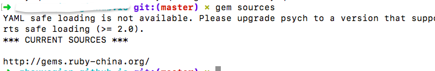
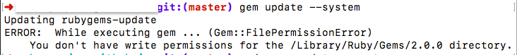
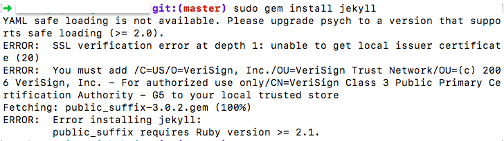

问题1：

命令：gem install jekyll

	ERROR:  Could not find a valid gem 'jekyll' (>= 0), here is why:
	          Unable to download data from https://rubygems.org/ - SSL_connect returned=1 errno=0 state=SSLv3 read server certificate B: certificate verify failed (https://rubygems.org/specs.4.8.gz)

解决办法：
	换个源就好了
	
	步骤1：查看gem源
	gem sources  
	步骤2：删除默认的gem源
	gem sources --remove http://rubygems.org/
	步骤3：增加taobao作为gem源
	gem sources -a http://gems.ruby-china.org/
	步骤4：查看当前的gem源
	gem sources
	

问题2：

命令：sudo gem install jekyll

	YAML safe loading is not available. Please upgrade psych to a version that supports safe loading (>= 2.0).
	ERROR:  SSL verification error at depth 1: unable to get local issuer certificate (20)
	ERROR:  You must add /C=US/O=VeriSign, Inc./OU=VeriSign Trust Network/OU=(c) 2006 VeriSign, Inc. - For authorized use only/CN=VeriSign Class 3 Public Primary Certification Authority - G5 to your local trusted store
	Fetching: public_suffix-3.0.2.gem (100%)
	ERROR:  Error installing jekyll:
		public_suffix requires Ruby version >= 2.1.

解决尝试1：更新gem自身

报错，遂：

	sudo gem update --system

更新成功，继续

还是报错，继续

解决尝试2：查看ruby和gem的版本，看情况重新下载，刚才已经升级过gem，所以我重新下载一个ruby的高版本

用rvm来下载

第一步：下载工具 （有就不用下载）

	sudo apt-get install curl git

第二步：下载

	curl -L get.rvm.io | bash -s stable

第三步：加载rvm

	source ~/.rvm/scripts/rvm

第四步：查看可以使用的ruby

	rvm list known

第五步：安装（我选择的是最新的版本）

	rvm install 2.4.1 

重新安装ruby成功！

继续尝试

	gem install jekyll

终于搞定！

总结：其实就是一个ruby的版本+gem源的问题，同时遇到，慌了步骤，以后遇到问题，先检查版本也是一个比较好的办法。