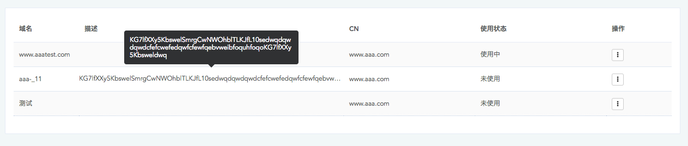
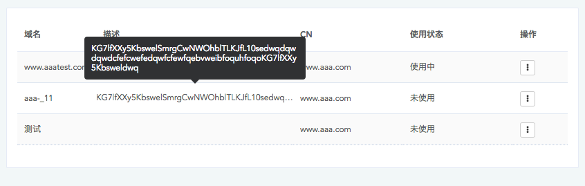
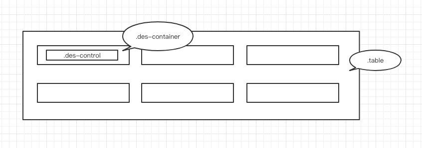

使用text-overflow的时候通常都会添加max-width属性，用来定义元素的最大宽度，但这个值通常为固定宽度、如果父元素宽度不定该如何设置样式？

效果图：

正常：

缩小宽度：

如何实现：绝对定位

	.des-container{
      position: relative;
    }
    
    
    .des-control{
      width: 100%;
      white-space:nowrap;
      overflow:hidden;
      text-overflow:ellipsis;
      table-layout: fixed;
      position: absolute;
      left: 0;
      top: 7px;
    }
    
    
 
 画了个位置关系图：
 
 